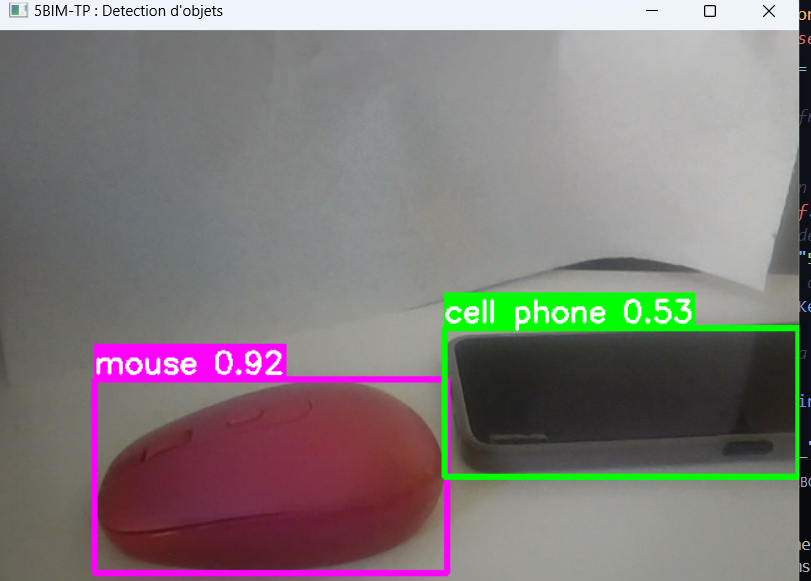

# TP 5BIM : Détection d'Ordinateurs et de Souris avec YOLO et OpenCV

## Contexte

Ce projet a été développé dans le cadre du TP de 5BIM pour mettre en pratique le concept d'objet connecté. L'objectif est de créer un système capable de détecter des ordinateurs portables et des souris dans un flux vidéo, en utilisant le modèle de détection d'objets YOLO (You Only Look Once) et la bibliothèque OpenCV.

## Fonctionnalités

- Détection en temps réel d'ordinateurs portables et de souris avec le modele pre entrainer YOLO8
- Visualisation delimiter par un rectangle des détections faites
- Affichage des label et de la confiance pour chaque objet détecté
- Prise en charge de flux vidéo en direct (webcam) ou de fichiers vidéo préenregistrés

## pré-requis

Pour lancer ce projet , il faut avoir dans votre ordinateur `python` installer , une `webcam` fontionel et une connection internet
pour l'installation des dependances.

## Installation

Dans votre terminal lancez les commandes suivantes:

1. Clonez ce dépôt :

   ```bash
   git clone https://github.com/Mleandra/TP-5BIM.git
   ```

   Deplacez vous dans le repertoire creer

```bash
cd TP-5BIM
```

2. Si vous utilisez les environments virtuelles

- Creez l'environment(Windows)
  ```bash
  python -m venv .env
  ```
- Activez l'environment
  ```bash
  .env\Scripts\activate
  ```

3. Installez les dépendances :
   ```bash
   pip install -r requirements.txt
   ```

## Utilisation

1. Pour détecter des objets à partir de la webcam, exécutez :

   ```bash
   python 5BIM_TP.py
   ```

2. Pour détecter des objets à partir d'un fichier vidéo, modifiez la variable `video` dans `5BIM_TP.py` :
   ```python
   video = 'chemin/vers/votre_video.mp4'
   ```

## Struture du programme

Les fichiers que vous trouverait sont :

- 5BIM_TP.py # Script principal pour la détection d'objets
- requirements.txt # Liste des dépendances du projet
- README.md # Documentation du projet

Dans le fichier 5BIM_TP.py se trouve :

1. La classe YoloObjectDetection qui contient 2 attributs :

- model : le modèle d'entrainement pour la détection d'objets
- colors : les couleurs appliquées aux rectangles des objets détecté
  et les methodes :
- `__init__  ` qui initialise le modèle YOLO(yolov8s) et définit les couleurs pour les différents objets à détecter

- `detect_and_draw ` qui prend une frame en entrée,détecte les objets ,dessine les rectangles et les labels sur l'image et retourne le frame annotée

- `detect_objects ` qui gère la capture vidéo (webcam ou fichier),applique la détection sur chaque frame et affiche le résultat

2. Bloc principal `(if **name** == "**main**")` :

- Définit la source vidéo (webcam par défaut ou fichier vidéo)
- Crée une instance de YoloObjectDetection
- Lance la détection sur le flux vidéo`

## Dependance

- Python 3.7+( la version utiliser pour ce tp est 3.10.11 )
- OpenCV 4.10.0.84
- Ultralytics

## Exemple



# Auteur

LEANDRA MAKAMTE
